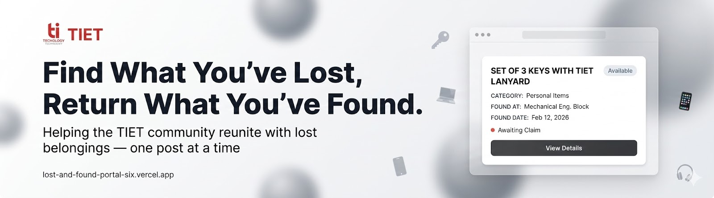

# 🎓 Thapar Institute Lost & Found System



A full-stack web application for managing lost and found items at **Thapar Institute of Engineering and Technology**. Users can browse found items, report lost ones, claim them back — all with admin oversight by **[Surya](https://surya-tiwari-portfolio.vercel.app/)** and **[Akshat](https://github.com/akshatkakkar1)** under the guidance of **[Navjot Sharma](https://github.com/navjotsharma5500)**.

## 🔗 **Live:** [CHECK IT OUT](https://lost-and-found-portal-six.vercel.app)

## ✨ Features

### 🌐 Public (no login required)

- 🔍 Browse and search all found items — filter by category, location, and time period
- 🖼️ View item details with images (lightbox viewer)
- 📊 Public statistics dashboard
- ℹ️ How It Works page

### 🔐 Authenticated Users (@thapar.edu Google accounts only)

- 📋 Claim found items with a proof description
- 🔄 Track claim status in real time (Pending / Approved / Rejected)
- ❌ Cancel a pending claim
- 📝 Report a lost item — with title, description, category, location, date, and photo uploads
- 🗂️ View, edit, and delete your own lost item reports
- ✅ Mark your own report as resolved when you recover your item
- 👤 View and edit your profile
- 📜 Full activity history — all your claims and reports in one place

### 🛡️ Admins

- ➕ Create, edit, delete found items (IDs auto-generated: ITEM000001, ITEM000002…)
- 📋 View all claims — filter by status (pending / approved / rejected)
- ✅ Approve a claim — automatically rejects all other claims for that item
- ❌ Reject claims with optional remarks
- 📑 View and manage all lost item reports
- 🔎 View detailed report pages with full user context
- 👥 View all users — search, filter, view their full activity history
- 🚫 Blacklist or unblacklist users (blocked users cannot claim or report)
- 📥 Export all data as CSV
- 🔍 Advanced search and filters across items, claims, reports, and users

---

## 🛠️ Tech Stack

| Layer      | Stack                                                       |
| ---------- | ----------------------------------------------------------- |
| Frontend   | React 19, React Router 7, Tailwind CSS, Framer Motion, Vite |
| Backend    | Node.js, Express 5, MongoDB + Mongoose, Redis (optional)    |
| Auth       | Google OAuth 2.0 + JWT (HTTP-only cookies)                  |
| Images     | ImageKit                                                    |
| Email      | Nodemailer                                                  |
| Deployment | Vercel                                                      |

---

## 🚀 Setup

### Prerequisites

- Node.js v18+
- MongoDB (local or Atlas)
- Redis (optional — caching falls back gracefully if unavailable)
- ImageKit account (optional — for image uploads)

### 1. Clone

```bash
git clone https://github.com/navjotsharma5500/softwareProject.git
cd softwareProject
```

### 2. Backend

```bash
cd backend
npm install
```

Create `backend/.env`:

```env
PORT=3000
MONGODB_URI=mongodb://localhost:27017/lostfound
JWT_SECRET=your_jwt_secret
NODE_ENV=development
FRONTEND_URL=http://localhost:5173

# Google OAuth
GOOGLE_CLIENT_ID=your-google-client-id
GOOGLE_CLIENT_SECRET=your-google-client-secret
GOOGLE_CALLBACK_URL=http://localhost:3000/api/auth/google/callback

# Gmail (optional — for email notifications)
GMAIL_USER=your-gmail@gmail.com
GMAIL_PASS=your-app-password

# ImageKit (optional — for image uploads)
IMAGEKIT_PUBLIC_KEY=your-public-key
IMAGEKIT_PRIVATE_KEY=your-private-key
IMAGEKIT_URL_ENDPOINT=https://ik.imagekit.io/your-id

# Redis (optional — for caching)
REDIS_URL=redis://localhost:6379
```

### 3. Frontend

```bash
cd ../frontend
npm install
```

Create `frontend/.env`:

```env
VITE_API_BASE_URL=http://localhost:3000/api
VITE_GOOGLE_CLIENT_ID=your-google-client-id
```

### 4. Run

```bash
# Terminal 1 — backend
cd backend && npm run dev

# Terminal 2 — frontend
cd frontend && npm run dev
```

- 🌐 Frontend: http://localhost:5173
- ⚙️ API: http://localhost:3000

### 5. Seed test data (optional)

```bash
cd backend && npm run seed
```

Inserts 1 admin user, 2 regular users, 15 found items, 5 lost-item reports, and 4 claims in mixed states into your local database.

To spin up a local MongoDB instance for development:

```bash
docker compose -f docker-compose.yml up -d
```

---

## 🎓 Admin Setup

Log in via Google OAuth, then run in MongoDB:

```js
db.users.updateOne(
  { email: "youremail@thapar.edu" },
  { $set: { isAdmin: true } },
);
```

---

## 📖 API Reference

| Method | Endpoint                         | Auth   |
| ------ | -------------------------------- | ------ |
| GET    | `/api/user/items`                | Public |
| GET    | `/api/user/items/:id`            | Public |
| GET    | `/api/stats`                     | Public |
| GET    | `/api/health`                    | Public |
| GET    | `/api/health/detailed`           | Public |
| GET    | `/api/auth/google`               | —      |
| POST   | `/api/auth/logout`               | Auth   |
| GET    | `/api/auth/profile`              | Auth   |
| POST   | `/api/user/items/:id/claim`      | Auth   |
| GET    | `/api/user/my-claims`            | Auth   |
| DELETE | `/api/user/my-claims/:claimId`   | Auth   |
| GET    | `/api/user/items/:id/my-claim`   | Auth   |
| GET    | `/api/user/profile`              | Auth   |
| PATCH  | `/api/user/profile`              | Auth   |
| POST   | `/api/reports`                   | Auth   |
| POST   | `/api/reports/upload-urls`       | Auth   |
| GET    | `/api/reports/my-reports`        | Auth   |
| GET    | `/api/reports/:id`               | Auth   |
| PATCH  | `/api/reports/:id`               | Auth   |
| DELETE | `/api/reports/:id`               | Auth   |
| PATCH  | `/api/reports/:id/resolve`       | Auth   |
| GET    | `/api/admin/items`               | Admin  |
| POST   | `/api/admin/items`               | Admin  |
| PATCH  | `/api/admin/items/:id`           | Admin  |
| DELETE | `/api/admin/items/:id`           | Admin  |
| GET    | `/api/admin/items/:id/claims`    | Admin  |
| GET    | `/api/admin/download-csv`        | Admin  |
| GET    | `/api/admin/claims`              | Admin  |
| PATCH  | `/api/admin/claims/:id/approve`  | Admin  |
| PATCH  | `/api/admin/claims/:id/reject`   | Admin  |
| GET    | `/api/admin/reports`             | Admin  |
| GET    | `/api/admin/reports/:id`         | Admin  |
| PATCH  | `/api/admin/reports/:id/status`  | Admin  |
| GET    | `/api/admin/users`               | Admin  |
| GET    | `/api/user/history/:userId`      | Admin  |
| PATCH  | `/api/admin/users/:id/blacklist` | Admin  |

> ⚡ Critical write endpoints (`/claim`, `POST /reports`, approve/reject) support idempotency via the `Idempotency-Key` request header.

---

_Made with ❤️ for Thapar Institute of Engineering and Technology_
